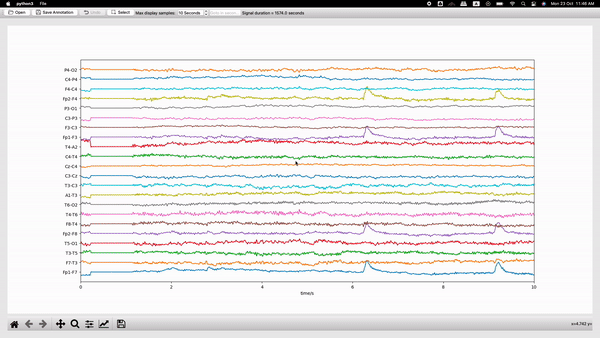

# EEG Annotation Tool

EEG annotation tool written in Python and PyQt6. It uses MNE Python for EEG signal reading and processing.

>Note: Current version of this app supports `.eeg`,`.edf` and `.fif` formats.



## Setting up your enviroment (Windows/Linux) 

1. Clone the repo: `git clone https://github.com/FrexG/eeg_annotator.git` 
2. Create a conda evironment (prefrable): `conda create -n eeg_annotator python=3.11.`
3. `conda activate eeg_annotator`
4. Install Required libs: `pip3 install -r requirements.txt`

## Usage

1. Change directory to `eeg_annotator` and run the following command to start the application:

   ``` bash
   python3 main.py

   ```

2. Load your EEG data by clicking on the "Open" button.
3. Use the "Bounding Rect Annotation" feature to annotate your data by pressing the `Label` button, left click and drag your mouse on the canvas to draw a rectangle selection.
4. You can move and resize the rectangle as you wish. When finish press the `Label` button again to provide annotation to the selected region.
5. Save your annotations by clicking on the `Save Annotations` button.
6. Use the `left/right` arrow keys to move through the EEG signal in time.

You can also change the bipolar montage type or add/remove labels in the `config.py` file

## Annotation
- The annotation file is a `.json` file with the same name as the EEG file and is saved in the same directory as the source EEG file.
- Each annotation file contains a list of dictionaries each describing a single selected region.
- `new` If annotation file already exists for a given reading they will be rendered upon opening.
- to add new labels edit `config.py` and add the new labels to `diagnosis` tuple.

``` json 
# example_annotation.json

[
    {
        "channels": [
            "P4-O2"
        ],
        "start_time": 1002,
        "stop_time": 1006,
        "onset": "GSCZ"
    },
    {
        "channels": [
            "F4-C4",
            "C4-P4",
            "P4-O2"
        ],
        "start_time": 530,
        "stop_time": 539,
        "onset": "FSCZ"
    },
    {
        "channels": [
            "Fp2-F4",
            "F4-C4",
            "C4-P4",
            "P4-O2"
        ],
        "start_time": 1041,
        "stop_time": 1045,
        "onset": "OSCZ"
    }
]
```

## License

This project is licensed under the MIT License - see the [LICENSE](LICENSE) file for details.

*Copyright 2023, Ethiopian Artificial Intelligence Institute*
